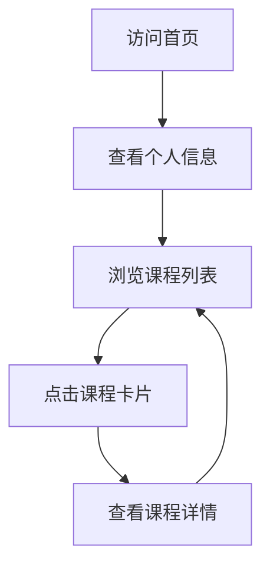

## 1. Product Overview
个人课程信息展示页面，用于展示广东科学技术职业学院商学院商务数据分析与应用专业学生Xww的课程信息。
- 主要目的是集中展示个人学习的课程信息，方便后续补充课程内容
- 目标用户是学生本人、同学、老师以及潜在的雇主，展示专业技能和学习成果

## 2. Core Features

### 2.1 User Roles
| Role | Registration Method | Core Permissions |
|------|---------------------|------------------|
| Visitor | 无需注册 | 浏览所有课程信息 |

### 2.2 Feature Module
1. **首页**: 个人信息展示，课程列表，课程详情预览

### 2.3 Page Details
| Page Name | Module Name | Feature description |
|-----------|-------------|---------------------|
| 首页 | 个人信息区 | 显示学生姓名、学校、专业等基本信息 |
| 首页 | 课程列表区 | 展示多个课程卡片，包含课程名称、简短描述 |
| 首页 | 课程详情预览 | 点击课程卡片可展开查看课程详细信息 |

## 3. Core Process
用户访问首页 → 查看个人基本信息 → 浏览课程列表 → 点击课程卡片查看详情

## 4. User Interface Design
### 4.1 Design Style
- 主色调：科技蓝 (#165DFF)、辅助色：浅灰 (#F5F7FA)、强调色：橙色 (#FF7D00)
- 按钮风格：圆角矩形，有轻微阴影
- 字体：无衬线字体，标题使用较大字号，正文使用适中字号
- 布局风格：卡片式布局，响应式设计
- 图标风格：简约线性图标

### 4.2 Page Design Overview
| Page Name | Module Name | UI Elements |
|-----------|-------------|-------------|
| 首页 | 个人信息区 | 居中布局，包含头像、姓名、学校、专业信息，使用卡片式设计，轻微阴影效果 |
| 首页 | 课程列表区 | 网格布局，每个课程为一个卡片，包含课程名称、简短描述、图标，卡片有悬停效果 |
| 首页 | 课程详情预览 | 点击课程卡片后展开，显示课程详细信息，包含课程目标、内容概述、学习成果等 |

### 4.3 Responsiveness
- 桌面优先设计，同时支持平板和移动设备
- 在小屏幕设备上，课程卡片布局从多列变为单列
- 触控设备优化，增大点击区域

### 4.4 3D Scene Guidance
- 无3D场景需求
