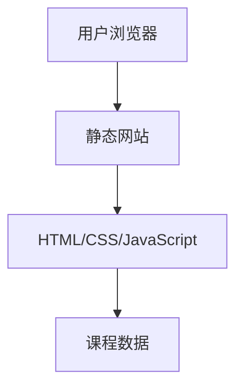
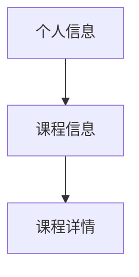

## 1. Architecture Design

## 2. Technology Description
- 前端: 纯静态HTML + CSS + JavaScript
- 样式框架: Tailwind CSS
- 构建工具: 无（纯静态文件）
- 部署平台: Cloudflare Pages

## 3. Route Definitions
| Route | Purpose |
|-------|---------|
| / | 首页，包含个人信息和课程列表 |

## 4. API Definitions
- 无API需求，所有数据直接内嵌在HTML中

## 5. Server Architecture Diagram
- 无服务器架构，纯静态网站

## 6. Data Model
### 6.1 Data Model Definition

### 6.2 Data Definition Language
- 无数据库需求，所有数据直接内嵌在HTML中
- 课程数据结构：
  - 课程名称
  - 课程描述
  - 课程详情（可展开）
  - 课程图标
